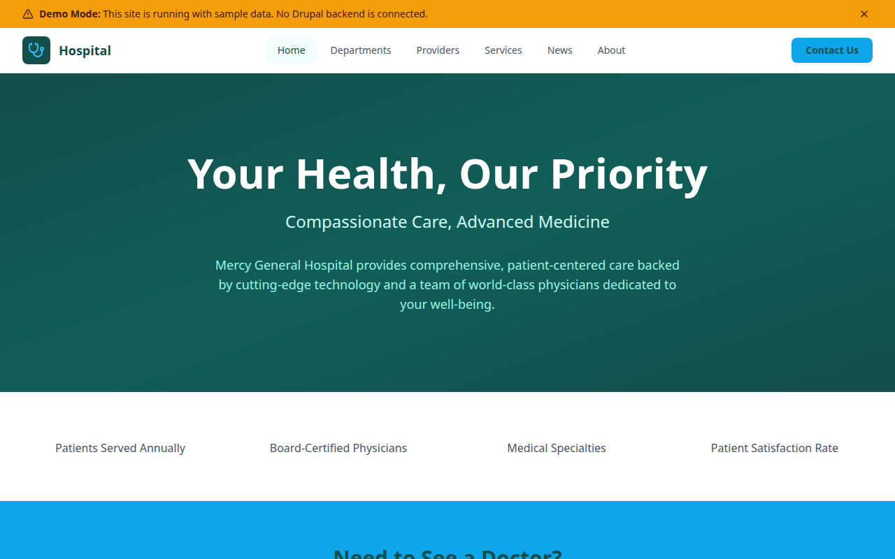

# Decoupled Hospital

A hospital and medical center website starter template for Decoupled Drupal + Next.js. Built for hospitals, health systems, medical centers, and healthcare organizations.



## Features

- **Departments** - Hospital departments and specialty areas with location, phone, and department head info
- **Providers** - Physician and specialist directory with credentials, education, specialties, and availability
- **Services** - Medical services and treatments organized by department
- **News** - Hospital news, health tips, and community announcements with featured articles
- **Modern Design** - Clean, accessible UI optimized for healthcare content

## Quick Start

### 1. Clone the template

```bash
npx degit nextagencyio/decoupled-hospital my-hospital
cd my-hospital
npm install
```

### 2. Run interactive setup

```bash
npm run setup
```

This interactive script will:
- Authenticate with Decoupled.io (opens browser)
- Create a new Drupal space
- Wait for provisioning (~90 seconds)
- Configure your `.env.local` file
- Import sample content

### 3. Start development

```bash
npm run dev
```

Visit [http://localhost:3000](http://localhost:3000)

---

## Manual Setup

If you prefer to run each step manually:

<details>
<summary>Click to expand manual setup steps</summary>

### Authenticate with Decoupled.io

```bash
npx decoupled-cli@latest auth login
```

### Create a Drupal space

```bash
npx decoupled-cli@latest spaces create "My Hospital"
```

Note the space ID returned. Wait ~90 seconds for provisioning.

### Configure environment

```bash
npx decoupled-cli@latest spaces env 1234 --write .env.local
```

### Import content

```bash
npm run setup-content
```

This imports:
- Homepage with hero, stats (50,000+ patients served, 300+ physicians, 40+ specialties, 97% satisfaction), and appointment CTA
- 4 departments: Cardiology, Oncology, Orthopedics, Emergency Medicine
- 4 providers: Dr. James Chen (Cardiology), Dr. Maria Santos (Oncology), Dr. Robert Kim (Orthopedics), Dr. Angela Williams (Emergency)
- 4 services: Cardiac Surgery, Cancer Treatment, Joint Replacement, Emergency & Trauma Care
- 3 news articles: Heart Failure Program Launch, Top 100 Hospital Award, Flu Vaccination Clinics
- 2 static pages: About Mercy General Hospital, Visitor Information

</details>

## Content Types

### Department
- **phone**: Department phone number
- **location**: Physical location within the hospital
- **department_head**: Name of the department head
- **department_type**: Department taxonomy (Cardiology, Oncology, Orthopedics, Emergency)
- **image**: Department image

### Provider
- **specialty**: Medical specialty taxonomy
- **email**: Provider email
- **phone**: Direct phone number
- **office**: Office location
- **photo**: Provider headshot
- **education**: Education and training credentials
- **accepting_patients**: Whether accepting new patients

### Service
- **department**: Associated department taxonomy
- **image**: Service image

### News Article
- **image**: Featured image
- **category**: Category taxonomy (Health News, Announcements, Community)
- **featured**: Whether the article is featured

### Homepage
- **hero_title**: Main headline (e.g., "Your Health, Our Priority")
- **hero_subtitle**: Tagline (e.g., "Compassionate Care, Advanced Medicine")
- **hero_description**: Introductory paragraph
- **stats_items**: Key statistics (patients, physicians, specialties, satisfaction)
- **featured_services_title**: Section heading for medical services
- **cta_title / cta_description**: Appointment scheduling call-to-action

### Basic Page
- General-purpose static content pages (About, Visitor Information, etc.)

## Customization

### Colors & Branding
Edit `tailwind.config.js` to customize colors, fonts, and spacing.

### Content Structure
Modify `data/hospital-content.json` to add or change content types and sample content.

### Components
React components are in `app/components/`. Update them to match your design needs.

## Demo Mode

Demo mode allows you to showcase the application without connecting to a Drupal backend.

### Enable Demo Mode

```bash
NEXT_PUBLIC_DEMO_MODE=true
```

### Removing Demo Mode

1. Delete `lib/demo-mode.ts`
2. Delete `data/mock/` directory
3. Delete `app/components/DemoModeBanner.tsx`
4. Remove `DemoModeBanner` from `app/layout.tsx`
5. Remove demo mode checks from `app/api/graphql/route.ts`

## Deployment

### Vercel (Recommended)
[](https://vercel.com/new/clone?repository-url=https://github.com/nextagencyio/decoupled-hospital)

### Other Platforms
Works with any Node.js hosting platform that supports Next.js.

## Documentation

- [Decoupled.io Docs](https://www.decoupled.io/docs)
- [Next.js Documentation](https://nextjs.org/docs)
- [Drupal GraphQL](https://www.decoupled.io/docs/graphql)

## License

MIT
